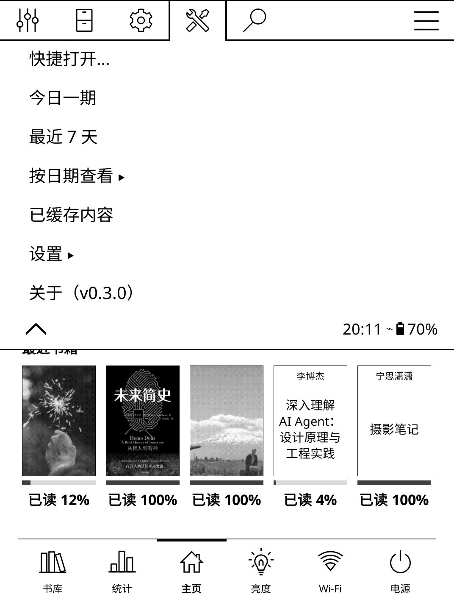
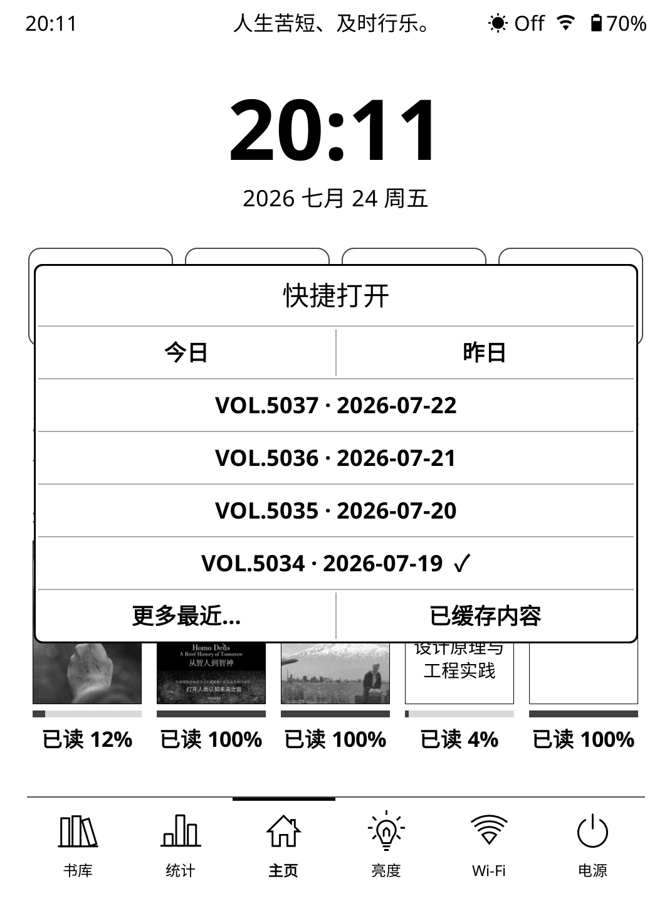
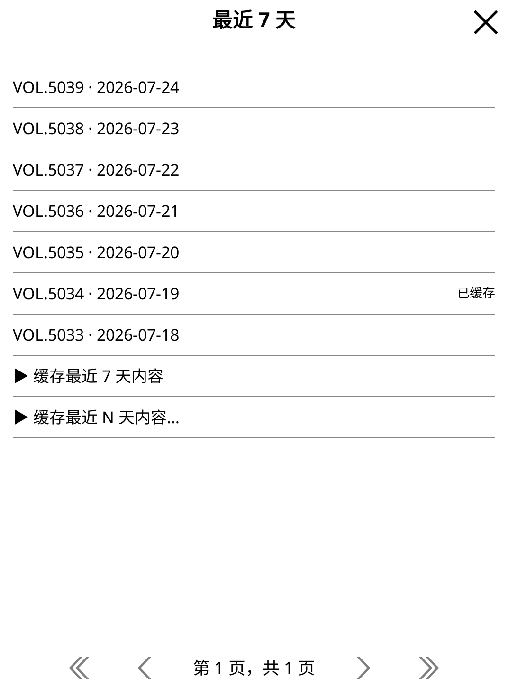

# one.koplugin

在 KOReader 上离线阅读「ONE · 一个」（wufazhuce.com）每日更新的内容。

每天只为你准备一张图片、一篇文字和一个问答。复杂世界，一个就够！

## 安装

把整个 `one.koplugin` 目录放到 KOReader 的 `plugins/` 下，重启 KOReader。
入口挂在 **顶部菜单 → 工具（Tools）标签 → ONE · 一个**（书架与书内均可进入）。

## 功能

| 主菜单 | 快捷菜单 | 最近 7 天 |
|:---:|:---:|:---:|
|  |  |  |

| 图文 | 文章 | 问答 |
|:---:|:---:|:---:|
|  |  |  |

## 声明

本项目仅供个人学习使用，不得用于商业用途，请遵守「ONE · 一个」的用户协议与相关法律法规。
